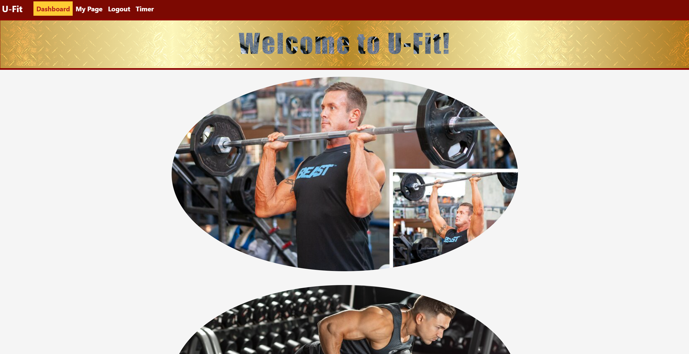
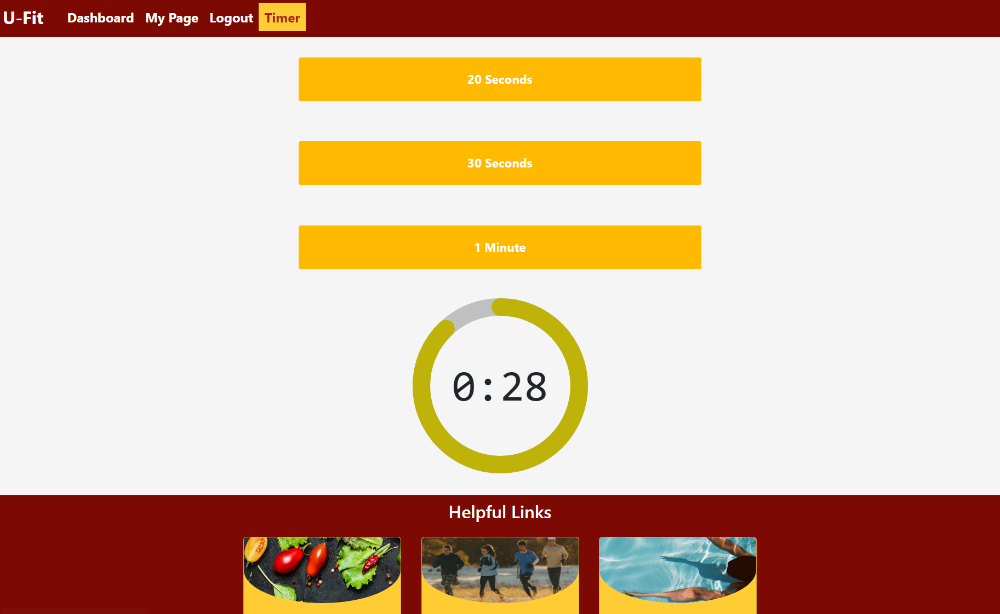

# Fitness-Tracker

U-Fit is an fitness tracker web application that helps the user to track their workouts and provides guides on exercises.

## Content

- [Description](#description)
- [How To Use](#how-to-use)
- [Future Development](#future-development)
- [Contributions](#contributions)
- [Credits](#credit)

## Description
 * [Link to Deployed Application (Heroku)](https://pure-savannah-65137.herokuapp.com)

## How To Use

* When user opens up the web application, main page(dashboard) shows up.
    

* Once User signup or login, they can see 'My Page'.
    * To signup, user needs to provide their first name, last name, username, email, password, age, height (cm), and weight (kg).
    

    

* My Page will show user's basic bio profile and option to add workout(s).
    

* User can select a workout from the given list and able to input repetition, exercise time, and distance if applicable to that workout.
    

* Once they add workout(s), the list of workouts will be displayed in My Page. User can click their workout(s) to see the their details or delete their workouts.
    

* User can sort their added workouts by given category menu. (Categorize by target)
    * **NOTE** Currently, there is no sort category by 'All'. After selecting category, if user wants to go back to see all of their workout list, they need to refresh the mypage by clicking refresh button on web broswer.
    

* User has option to modify their profile, which includes their age, height, and weight.
    

* Timer page provides user three different timers for their exercise(s) (20 sec, 30 sec, 1 min).
    

* User has access to both Dashboard and Timer with or without being logged in.
* The footer includes useful links for exercise that user can refer to for their exercise.
    

* Wep application also supports mobile view.

    

## Future Development
- Implement features to add and update user's exercise progress and share user's workouts and progress to dashboard so other user can see it.
    - Implement the feature for user to either like or comment on the shared workouts.
    - **NOTE** Currently, images are filled out for dashboard instead user's post.
- Implement feature to sort by 'All' on category menu.
- Implement achievement system when user finishes their workouts and to be able to share their achievements on dashboard. 
- Implement categorization of workouts list when user adds workouts. 
- Add more useful links for exercises.

## Contributions 
- Taeyoung Park:  [ taeyoungP](https://github.com/taeyoungP)
- Jeremiah Dorvil:  [ jeremiahdorvil](https://github.com/jeremiahdorvil)
- Samson Paul:  [ sampaul10](https://github.com/sampaul10)
- Joel Wesch:  [ jrwesch](https://github.com/jrwesch)
- Khamla Soumpholphakdy:  [ Soumpholphakdy](https://github.com/Soumpholphakdy)

## Credits
- [Bootstrap](https://getbootstrap.com/)
- [Heroku](https://www.heroku.com/)
- [MongoDB Atlas](https://www.mongodb.com/atlas/database)
- CSS stylings that are used for Dashboard page: https://codepen.io/robb0wen/pen/KKoVOrq, http://www.brandgradients.com/gold-gradient/
- CSS stylings that are used for Timer component: https://codepen.io/thebabydino/pen/RwPNaEd, https://codesandbox.io/s/sad-zhukovsky-hs7hc
- How to refetch data after data deletion (Refetching queries): https://stackoverflow.com/questions/72801198/apollo-client-refetch-queries

